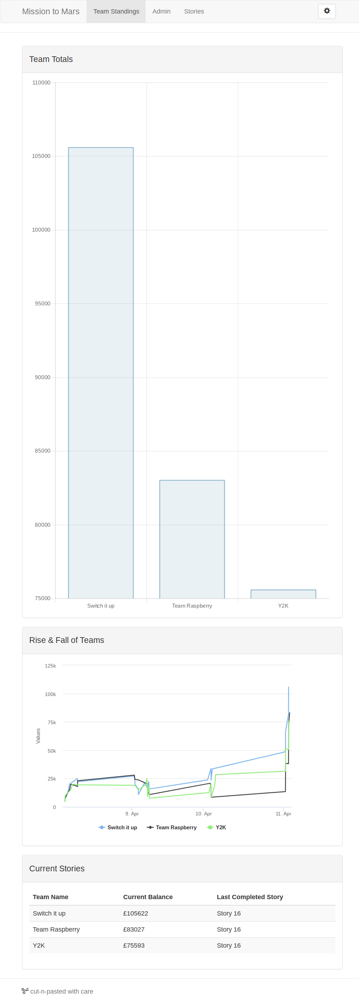

# Mission to Mars: Easter 2019
Code created by the six teams at the Easter 2019 Mission to Mars work
experience program, hosted at the Cornwall College campus in St. Austell. Students were
given the support of a team of mentors from local education and businesses and
tasked to complete the provided manoeuvrability challenges.

## Results
The challenges come with a Core Coin reward, with the prizes being totted up via
the teams dashboard.

The results were:

1. Switch it up            - $105,622
2. Team Raspberry          - $83,027
3. Y2K                     - $75,593

## Usage Instructions
Clone the project locally and check out the various .ino files.
